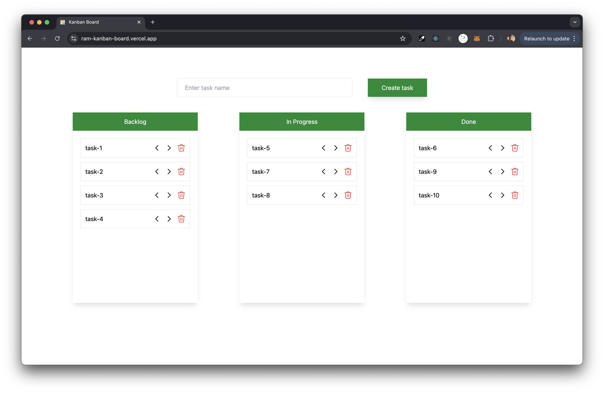

# Kanban Board Application

This Kanban Board application allows users to create, manage, and track tasks through different stages of a workflow. Built with React, it provides a user-friendly interface to enhance productivity and task management.

## Features

- **Create Tasks**: Add new tasks with unique names.
- **Manage Stages**: Move tasks between stages: Backlog, In Progress, and Done.
- **Delete Tasks**: Remove tasks from the board.

## Screenshots

  
*Figure 1: Kanban Board Interface*

## Live Demo

You can view the live demo of the Kanban application [here](https://ram-kanban-board.vercel.app).

## Installation

To run this project locally, follow these steps:

1. **Clone the repository**:
   ```bash
   git clone https://github.com/ramtanniru/Kanban-board
   ```

2. **Navigate to the project directory**:
   ```bash
   cd kanban-app
   ```

3. **Install the dependencies**:
   ```bash
   npm install
   ```

4. **Run the application**:
   ```bash
   npm start
   ```

5. Open your browser and visit `http://localhost:5127` to view the application.

## Technologies Used

- **React**: JavaScript library for building user interfaces
- **Tailwind CSS**: Utility-first CSS framework for styling
- **JavaScript**: Programming language for web development

## Contributing

If you'd like to contribute to this project, please fork the repository and submit a pull request.

## License

This project is licensed under the MIT License.
